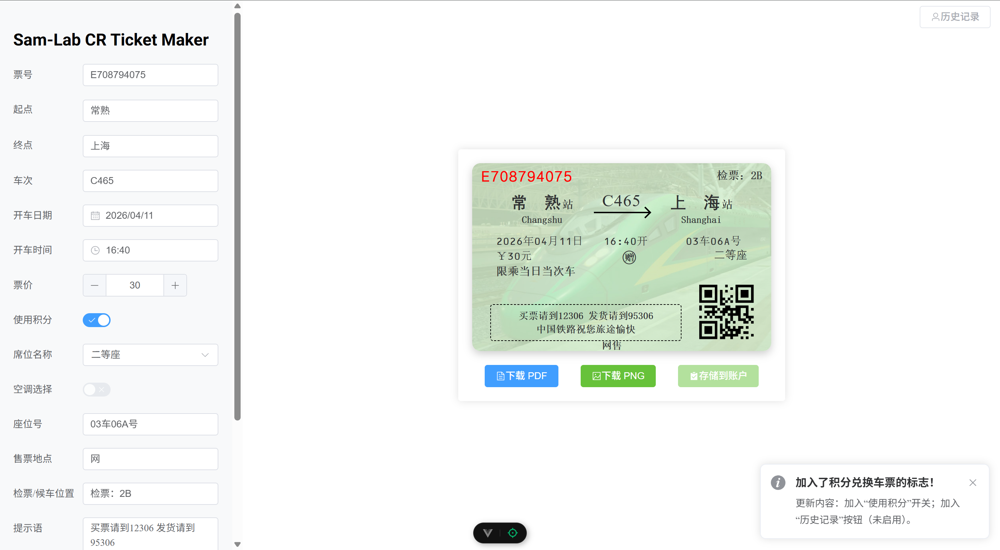

# CR Ticket Maker

## 特别提醒

**目前中国铁路要求持个人有效证件乘车，不再接受纸质车票。这个网站生成的车票无法作为乘车凭证使用！！！**



## 优点

- 可离线部署运行；
- 不记名车票，无需担心数据泄露；
- 多种背景选择。

## 使用说明

### 票号

可自定义。建议是一个字母加一串数字。

### 起点、终点

可以输入汉字、拼音、拼音首字母。输入后可在下方的弹出菜单中快速选择补全。车站列表与12306同步。添加不存在的站点会导致无法生成英文。

### 车次

规则：允许4位数车次。允许以5开头的5位数车次。允许以GCDZTKLYS开头，1~4位数字的车次。

### 开车时间、日期

使用Element Plus风格的时间日期选择器以选择时间。

### 票价

在输入框中可以输入>0的数字。按+-的步长为0.5.

### 使用积分

开启开关后，车票上显示“赠”字，该车票的价格将不计入运转年度小结中。

### 席位名称

导入自12306，仅可在列表中选择。Egg: 加入了“棚车”的选项。

### 空调选择

开启开关后，在坐席前显示“新空调”三字。仅在席位选择合法时启用。

### 座位号、售票地、检票口、提示语

可以自定义。

### 背景

目前有数种选项。如果有自己的照片可以提交。

### 下载

可以下载到PDF或者PNG文件。

### 历史记录和车票存储

开发中...

## 样例


## 构建

### 环境要求

- Node.js：`^20.19.0` 或 `>=22.12.0`
- npm：建议使用与 Node.js 配套的最新版本

### 安装依赖

```bash
npm install
```

### 开发模式（前端）

```bash
npm run dev
```

默认启动 Vite 开发服务器（通常为 `http://localhost:5173`）。

### 启动后端服务

```bash
node server/app.js
```

后端默认地址：`http://localhost:3000`，接口前缀如下：

- `/api/user`
- `/api/ticket`

### 生产构建

```bash
npm run build
```

构建产物输出到 `dist/` 目录。

### 本地预览构建产物

```bash
npm run preview
```

## 提交

可以在`/public`目录下提交自己的照片。大小比例为86/54. 要求处理好上传。

不允许增加或删除站点信息。

如果您有代码优化的方案，直接提交即可。

## 未来规划

- Android等移动平台应用程式开发；
- 加入账户管理功能，存储历史生成过的车票。
